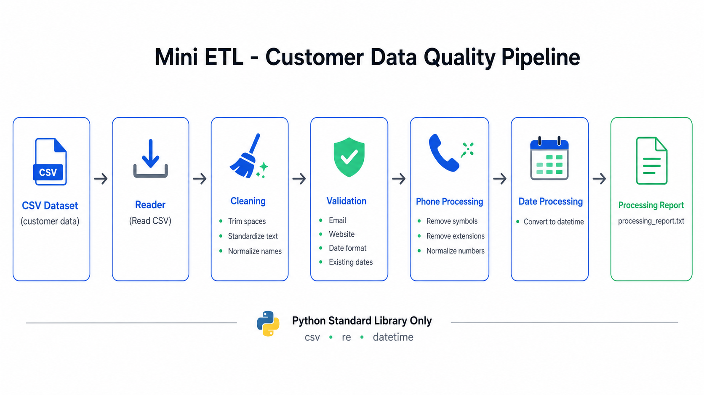
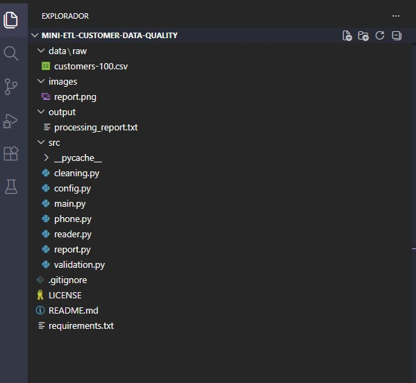
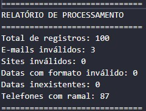
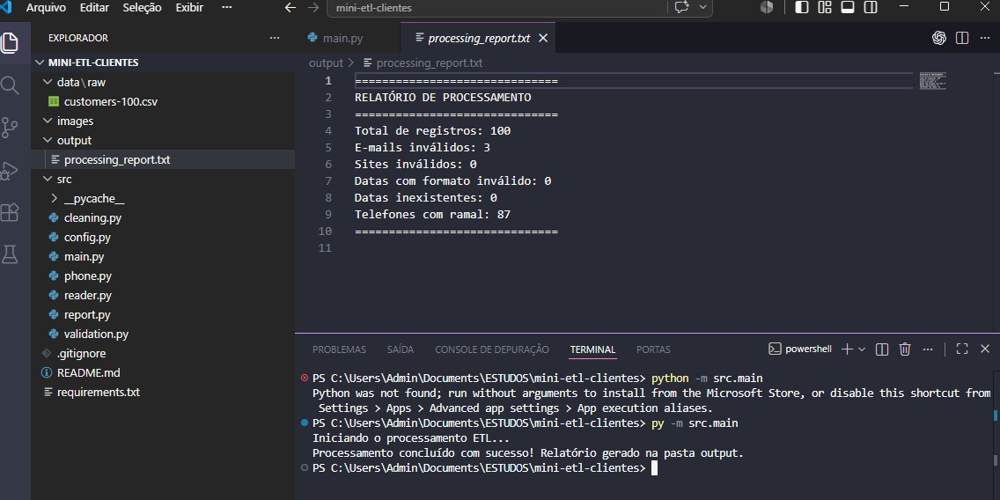

# 🚀 Mini ETL - Customer Data Quality Pipeline

> Pipeline ETL desenvolvido em Python puro para leitura, limpeza, validação, padronização e geração de relatórios de qualidade de dados a partir de arquivos CSV. Projeto criado como parte da minha jornada de formação em Engenharia de Dados, priorizando o entendimento dos fundamentos antes do uso de bibliotecas como Pandas.

---

# 📚 Contexto

Este projeto marca o encerramento da minha primeira etapa de estudos em Python rumo à Engenharia de Dados.

Antes de iniciá-lo, concluí:

- 📖 Livro **Introdução à Programação com Python**, de Nilo Ney Coutinho Menezes.
- 🎓 Formação **Python para Dados** da carreira de Engenharia de Dados na Alura:
  - Python para Dados: Primeiros Passos
  - Python para Dados: Trabalhando com Funções, Estruturas de Dados e Exceções
  - Python: Aplicando a Orientação a Objetos

Após finalizar esses estudos, decidi desenvolver um projeto prático para colocar em prática tudo o que havia aprendido.

Ao invés de utilizar bibliotecas como Pandas desde o início, optei por implementar todas as etapas utilizando apenas recursos nativos da linguagem Python.

Essa decisão teve um objetivo muito claro:

> Antes de utilizar ferramentas que abstraem a complexidade, eu queria compreender como essas operações funcionam internamente.

Acredito que dominar os fundamentos torna o aprendizado das ferramentas muito mais sólido.

---

# 🎯 Objetivo do projeto

O objetivo deste projeto foi simular um problema real encontrado em Engenharia de Dados:

Simular uma etapa de qualidade de dados presente em pipelines de Engenharia de Dados, recebendo um arquivo CSV de clientes e executando processos de leitura, limpeza, validação, transformação e geração de relatórios:

- ler os dados;
- limpar informações;
- validar inconsistências;
- padronizar formatos;
- transformar os dados;
- gerar um relatório de qualidade.

Todo esse processo foi desenvolvido manualmente, utilizando apenas Python puro.

---

# 🎯 Decisões de Projeto

Durante o desenvolvimento deste projeto tomei algumas decisões que podem parecer incomuns à primeira vista, mas que fizeram parte do meu plano de formação em Engenharia de Dados.

## Não utilizar Pandas

Mesmo já sendo a principal biblioteca para manipulação de dados em Python, decidi não utilizá-la nesta primeira versão.

O objetivo foi compreender como operações como leitura, limpeza, validação e transformação de dados funcionam utilizando apenas recursos nativos da linguagem.

Acredito que dominar os fundamentos antes das abstrações facilita muito o aprendizado de ferramentas mais avançadas.

---

## Utilizar listas bidimensionais

Em vez de DataFrames, todos os registros foram armazenados inicialmente em listas bidimensionais.

Essa escolha permitiu compreender melhor como um arquivo CSV é representado em memória e como percorrer, acessar e transformar cada registro manualmente.

---

## Modularizar desde o início

Mesmo sendo um projeto de estudo, procurei organizar o código em módulos separados.

Cada módulo possui uma responsabilidade específica:

- leitura;
- limpeza;
- validação;
- tratamento de telefones;
- geração de relatórios.

Essa organização se aproxima da estrutura encontrada em projetos reais de Engenharia de Dados.

---

## Priorizar aprendizado antes de otimização

O foco desta primeira versão foi desenvolver raciocínio lógico e compreender o funcionamento do pipeline.

Questões como desempenho, processamento em streaming e uso de bibliotecas especializadas serão trabalhadas nas próximas versões do projeto.

---

# 📂 Dataset

O dataset utilizado contém informações fictícias de clientes.

Campos disponíveis:

- Index
- Customer Id
- First Name
- Last Name
- Company
- City
- Country
- Phone 1
- Phone 2
- Email
- Subscription Date
- Website

A versão utilizada neste projeto possui aproximadamente **100 registros**, mas o mesmo repositório disponibiliza versões com **10.000** e **1.000.000** de registros, que serão utilizadas em versões futuras deste projeto.

---

# 🛠 Tecnologias

- Python 3
- csv
- datetime
- re (Expressões Regulares)

Bibliotecas propositalmente **não utilizadas**:

- Pandas
- NumPy
- Polars

O objetivo era exercitar lógica de programação e manipulação de dados utilizando apenas a linguagem.

---

# 🧠 Conhecimentos aplicados

Durante este projeto consegui colocar em prática praticamente todos os assuntos estudados na minha formação.

| Conceito | Aplicação |
|----------|-----------|
| Variáveis | Manipulação dos registros |
| Condicionais | Regras de validação |
| Estruturas de repetição | Processamento linha a linha |
| Funções | Organização do pipeline |
| Modularização | Separação dos arquivos do projeto |
| Listas | Estrutura principal dos dados |
| Listas bidimensionais | Representação do CSV |
| Desempacotamento | Manipulação das colunas |
| Strings | Limpeza e padronização |
| Regex | Validação de datas |
| datetime | Conversão de datas |
| Manipulação de arquivos | Leitura do CSV |
| Exceptions | Tratamentos durante o processamento |
| Generators | Impressão dos relatórios |

---

# 🏗 Arquitetura do Pipeline

<p align="center">
  
</p>

O pipeline foi dividido em etapas independentes, simulando o fluxo encontrado em processos ETL reais. Cada módulo possui uma responsabilidade específica, facilitando manutenção, testes e evolução do projeto.

---

# 📁 Estrutura do Projeto

<p align="center">
  
</p>

A organização em módulos foi adotada desde o início para aproximar o projeto da estrutura encontrada em aplicações reais de Engenharia de Dados.

---

# ⚙️ Etapas implementadas

## 📥 Leitura do CSV

Leitura do arquivo utilizando o módulo `csv`.

Conversão do conteúdo para uma lista bidimensional para posterior processamento.

---

## 🧹 Limpeza dos dados

Padronização dos registros através de:

- remoção de espaços;
- padronização de nomes;
- normalização de textos.

---

## 📧 Validação de e-mails

Verificação de:

- campos vazios;
- presença do caractere `@`.

---

## 🌐 Validação de websites

Validação da existência dos protocolos:

- http://
- https://

---

## 📅 Validação das datas

Validação em duas etapas:

1. Verificação do formato `YYYY-MM-DD`;
2. Verificação da existência da data de acordo com o mês informado.

Após a validação, as datas são convertidas para objetos `datetime.date`.

---

## ☎️ Padronização dos telefones

Os telefones aparecem em diversos formatos.

Exemplos:

```
229.077.5154
+1-539-402-0259
001-234-203-0635x76146
(283)437-3886x88321
```

Foi desenvolvido um processo para:

- remover caracteres especiais;
- remover ramais;
- deixar os números em um formato consistente.

---

## 📄 Relatório

Exemplo do relatório gerado automaticamente pelo pipeline.

<p align="center">
  
</p>

---

# 💻 Como executar

Clone o repositório:

```bash
git clone https://github.com/SEU-USUARIO/mini-etl-customer-data-quality.git
```

Entre na pasta:

```bash
cd mini-etl-customer-data-quality
```

Execute:

```bash
python src/main.py
```
Resultado da execução:

<p align="center">
  
</p>

```
output/
```

---

# 📖 O que aprendi

Mais importante do que concluir um projeto funcional foi compreender como as operações de manipulação de dados realmente funcionam.

Ao implementar manualmente cada etapa do pipeline consegui aprofundar conhecimentos sobre:

- processamento de arquivos;
- limpeza de dados;
- validação de informações;
- organização de código;
- construção de pipelines;
- modularização.

Tenho convicção de que esse conhecimento facilitará o aprendizado de bibliotecas como Pandas, pois agora compreendo quais abstrações elas oferecem.

---

# 🚀 Próximos passos

Este projeto será evoluído em etapas.

## Versão 2

- Reimplementação utilizando Pandas.

## Versão 3

- Integração com SQLite.

## Versão 4

- Integração com PostgreSQL.

## Versão 5

- Processamento de datasets com 1 milhão de registros.

## Versão 6

- Processamento em streaming.

## Versão 7

- Comparação de desempenho entre diferentes abordagens de processamento.

---

# 🗺️ Roadmap de Aprendizagem

Este projeto faz parte da construção do meu portfólio em Engenharia de Dados.

Cada projeto representa uma etapa da minha evolução técnica.

Fundamentos de Python
        │
        ▼
Mini ETL (Python puro) ✅
        │
        ▼
Mini ETL com Pandas
        │
        ▼
Mini ETL + SQLite
        │
        ▼
Mini ETL + PostgreSQL
        │
        ▼
Pipeline ETL
        │
        ▼
Apache Airflow
        │
        ▼
Apache Spark
        │
        ▼
Cloud Data Engineering

---

# 👨‍💻 Sobre mim

Meu nome é **Iago Araújo dos Santos**.

Sou bacharel em Ciência da Computação e atuo como Analista de Dados no Instituto Bold. 

Atualmente estou direcionando minha carreira para Engenharia de Dados e construindo um portfólio de projetos que simulam problemas encontrados no dia a dia da área.

Meu plano de estudos segue uma evolução gradual:

Python → SQL → Pandas → Bancos de Dados → ETL → Engenharia de Dados → Big Data.

Cada projeto do meu portfólio representa uma etapa dessa jornada, buscando consolidar os fundamentos antes de avançar para ferramentas e arquiteturas mais complexas.